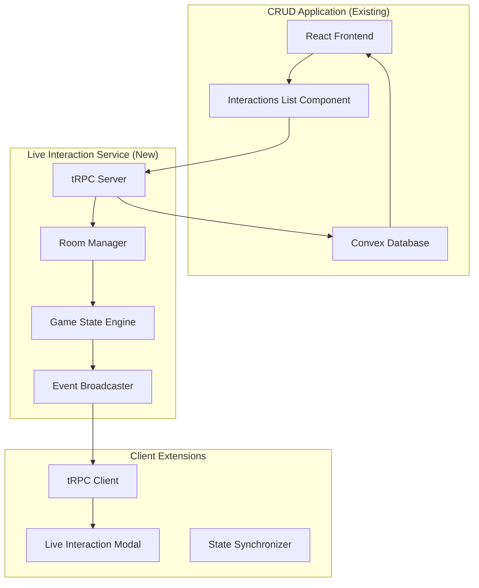

# Live Interaction System Design Document

## Overview

The Live Interaction System is a real-time multiplayer service that enables D&D 5e players and Dungeon Masters to conduct synchronized interactive sessions. The system operates as a separate containerized Node.js application alongside the existing React/Convex CRUD application, connected through tRPC for real-time communication and Convex for persistent data storage.

### Key Design Principles

- **Separation of Concerns**: Live system handles real-time state, CRUD app handles persistent data
- **Event-Driven Architecture**: All state changes propagated via events and subscriptions
- **Optimistic Updates**: Client-side predictions with server validation
- **Graceful Degradation**: System continues functioning during network issues
- **Horizontal Scalability**: Containerized architecture supports multiple instances

## Architecture

### System Components



### Data Flow Architecture

1. **Interaction Creation**: DM creates interaction in CRUD app → stored in Convex
2. **Live Activation**: DM sets status to "live" → tRPC server creates room → loads initial state
3. **Player Connection**: Players join via interactions list → authenticate → join room
4. **Real-Time Play**: Actions submitted → validated → state updated → deltas broadcast
5. **State Persistence**: Snapshots saved to Convex at defined intervals
6. **Session End**: Final state persisted → room cleaned up

### Technology Stack

- **Live Server**: Node.js + tRPC + WebSocket subscriptions
- **Authentication**: Clerk JWT tokens
- **State Management**: In-memory with Redis backup (future)
- **Persistence**: Convex database (shared with CRUD app)
- **Validation**: Zod schemas
- **Deployment**: Docker containers

## Components and Interfaces

### 1. tRPC Server Architecture

#### Core Server Structure
```typescript
// server/index.ts
interface LiveServer {
  rooms: Map<string, InteractionRoom>
  roomManager: RoomManager
  gameEngine: GameStateEngine
  eventBroadcaster: EventBroadcaster
}

interface InteractionRoom {
  id: string
  interactionId: string
  participants: Map<string, Participant>
  gameState: GameState
  lastActivity: Date
  status: 'active' | 'paused' | 'completed'
}
```

#### tRPC Router Definition
```typescript
// server/routers/interaction.ts
export const interactionRouter = router({
  // Room Management
  joinRoom: protectedProcedure
    .input(z.object({ interactionId: z.string() }))
    .mutation(async ({ input, ctx }) => { /* ... */ }),
    
  leaveRoom: protectedProcedure
    .input(z.object({ interactionId: z.string() }))
    .mutation(async ({ input, ctx }) => { /* ... */ }),
    
  // Game Actions
  takeTurn: protectedProcedure
    .input(TurnActionSchema)
    .mutation(async ({ input, ctx }) => { /* ... */ }),
    
  // Real-time Subscriptions
  roomUpdates: protectedProcedure
    .input(z.object({ interactionId: z.string() }))
    .subscription(async ({ input, ctx }) => { /* ... */ }),
    
  // DM Controls
  pauseInteraction: dmOnlyProcedure
    .input(z.object({ interactionId: z.string() }))
    .mutation(async ({ input, ctx }) => { /* ... */ }),
})
```

### 2. Game State Engine

#### State Model
```typescript
interface GameState {
  interactionId: string
  status: 'waiting' | 'active' | 'paused' | 'completed'
  initiativeOrder: InitiativeEntry[]
  currentTurnIndex: number
  roundNumber: number
  participants: Map<string, ParticipantState>
  mapState: MapState
  turnHistory: TurnRecord[]
  chatLog: ChatMessage[]
  timestamp: Date
}

interface ParticipantState {
  entityId: string
  entityType: 'playerCharacter' | 'npc' | 'monster'
  userId?: string
  currentHP: number
  maxHP: number
  position: { x: number, y: number }
  conditions: StatusEffect[]
  inventory: InventoryState
  availableActions: Action[]
  turnStatus: 'waiting' | 'active' | 'completed' | 'skipped'
}
```

#### Action Validation System
```typescript
interface ActionValidator {
  validateTurnAction(
    action: TurnAction,
    participant: ParticipantState,
    gameState: GameState
  ): ValidationResult
  
  validateMovement(
    from: Position,
    to: Position,
    participant: ParticipantState,
    mapState: MapState
  ): ValidationResult
  
  validateItemUsage(
    itemId: string,
    participant: ParticipantState,
    target?: string
  ): ValidationResult
}
```

### 3. Room Manager

#### Room Lifecycle Management
```typescript
interface RoomManager {
  createRoom(interactionId: string): Promise<InteractionRoom>
  getRoom(interactionId: string): InteractionRoom | null
  joinRoom(interactionId: string, userId: string): Promise<void>
  leaveRoom(interactionId: string, userId: string): Promise<void>
  pauseRoom(interactionId: string): Promise<void>
  resumeRoom(interactionId: string): Promise<void>
  cleanupInactiveRooms(): Promise<void>
}
```

#### State Persistence Strategy
```typescript
interface StatePersistence {
  saveSnapshot(interactionId: string, gameState: GameState): Promise<void>
  loadSnapshot(interactionId: string): Promise<GameState | null>
  
  // Trigger conditions for snapshots
  shouldSaveSnapshot(event: GameEvent): boolean
  // - End of initiative round
  // - Player disconnect
  // - Entity defeated
  // - DM disconnect
  // - Interaction paused/completed
  // - Inactivity timeout
}
```

### 4. Event Broadcasting System

#### Event Types
```typescript
type GameEvent = 
  | { type: 'PARTICIPANT_JOINED', userId: string, entityId: string }
  | { type: 'PARTICIPANT_LEFT', userId: string }
  | { type: 'TURN_STARTED', entityId: string, timeLimit: number }
  | { type: 'TURN_COMPLETED', entityId: string, actions: TurnAction[] }
  | { type: 'TURN_SKIPPED', entityId: string, reason: string }
  | { type: 'STATE_DELTA', changes: StateDelta }
  | { type: 'CHAT_MESSAGE', message: ChatMessage }
  | { type: 'INITIATIVE_UPDATED', order: InitiativeEntry[] }
  | { type: 'INTERACTION_PAUSED', reason: string }
  | { type: 'INTERACTION_RESUMED' }
  | { type: 'ERROR', error: GameError }

interface EventBroadcaster {
  broadcast(roomId: string, event: GameEvent): void
  broadcastToUser(roomId: string, userId: string, event: GameEvent): void
  broadcastDelta(roomId: string, delta: StateDelta): void
}
```

### 5. Client-Side Integration

#### Live Interaction Modal Component
```typescript
interface LiveInteractionModal {
  // Props
  interactionId: string
  isOpen: boolean
  onClose: () => void
  
  // State
  gameState: GameState | null
  connectionStatus: 'connecting' | 'connected' | 'disconnected'
  currentUser: ParticipantState | null
  
  // Sections
  renderTurnInterface(): JSX.Element
  renderInitiativeOrder(): JSX.Element
  renderMapView(): JSX.Element
  renderInventory(): JSX.Element
  renderChatSystem(): JSX.Element
  renderDMControls(): JSX.Element // DM only
}
```

#### tRPC Client Integration
```typescript
// client/hooks/useLiveInteraction.ts
export function useLiveInteraction(interactionId: string) {
  const joinRoom = trpc.interaction.joinRoom.useMutation()
  const takeTurn = trpc.interaction.takeTurn.useMutation()
  
  // Real-time subscription
  trpc.interaction.roomUpdates.useSubscription(
    { interactionId },
    {
      onData: (event) => {
        // Handle real-time updates
        handleGameEvent(event)
      },
      onError: (error) => {
        // Handle connection errors
        handleConnectionError(error)
      }
    }
  )
  
  return {
    gameState,
    connectionStatus,
    actions: { joinRoom, takeTurn, /* ... */ }
  }
}
```

### 6. Interactions List Component Enhancement

#### Integration Points
```typescript
interface InteractionsListComponent {
  // Existing CRUD functionality
  interactions: Interaction[]
  
  // New live functionality
  liveStatuses: Map<string, LiveStatus>
  
  // Actions
  onJoinLiveInteraction: (interactionId: string) => void
  onSetInteractionLive: (interactionId: string) => void
  onPauseInteraction: (interactionId: string) => void
  onCompleteInteraction: (interactionId: string) => void
}

interface LiveStatus {
  status: 'idle' | 'live' | 'paused' | 'completed'
  participantCount: number
  currentTurn?: string
  lastActivity: Date
}
```

## Data Models

### Enhanced Convex Schema Extensions

```typescript
// Additional fields for interactions table
interactions: defineTable({
  // ... existing fields ...
  
  // Live system specific fields
  liveStatus: v.union(
    v.literal("idle"),
    v.literal("live"), 
    v.literal("paused"),
    v.literal("completed")
  ),
  liveRoomId: v.optional(v.string()),
  lastStateSnapshot: v.optional(v.any()),
  snapshotTimestamp: v.optional(v.number()),
  
  // Connection tracking
  connectedParticipants: v.optional(v.array(v.string())),
  lastActivity: v.optional(v.number()),
  
  // Turn management
  currentTurnTimeout: v.optional(v.number()),
  turnTimeLimit: v.optional(v.number()), // seconds
  
  // Chat and communication
  chatEnabled: v.optional(v.boolean()),
  allowPrivateChat: v.optional(v.boolean()),
})

// New table for live interaction logs
liveInteractionLogs: defineTable({
  interactionId: v.id("interactions"),
  eventType: v.string(),
  eventData: v.any(),
  userId: v.optional(v.id("users")),
  entityId: v.optional(v.string()),
  timestamp: v.number(),
  sessionId: v.string(), // For grouping events by session
})

// New table for turn records
turnRecords: defineTable({
  interactionId: v.id("interactions"),
  entityId: v.string(),
  entityType: v.union(
    v.literal("playerCharacter"),
    v.literal("npc"), 
    v.literal("monster")
  ),
  turnNumber: v.number(),
  roundNumber: v.number(),
  actions: v.array(v.any()),
  startTime: v.number(),
  endTime: v.optional(v.number()),
  status: v.union(
    v.literal("completed"),
    v.literal("skipped"),
    v.literal("timeout")
  ),
  userId: v.optional(v.id("users")),
})
```

### Live System Data Models

```typescript
// Turn action schemas
const TurnActionSchema = z.object({
  type: z.enum(['move', 'attack', 'useItem', 'cast', 'interact', 'end']),
  entityId: z.string(),
  target: z.optional(z.string()),
  position: z.optional(z.object({ x: z.number(), y: z.number() })),
  itemId: z.optional(z.string()),
  spellId: z.optional(z.string()),
  actionId: z.optional(z.string()),
  parameters: z.optional(z.record(z.any())),
})

// Chat message schema
const ChatMessageSchema = z.object({
  id: z.string(),
  userId: z.string(),
  entityId: z.optional(z.string()),
  content: z.string(),
  type: z.enum(['party', 'dm', 'private', 'system']),
  recipients: z.optional(z.array(z.string())),
  timestamp: z.number(),
})

// State delta schema for efficient updates
const StateDeltaSchema = z.object({
  type: z.enum(['participant', 'turn', 'map', 'initiative', 'chat']),
  changes: z.record(z.any()),
  timestamp: z.number(),
})
```

## Error Handling

### Connection Management

```typescript
interface ConnectionHandler {
  handlePlayerDisconnect(userId: string, interactionId: string): void
  handleDMDisconnect(dmUserId: string, interactionId: string): void
  handleReconnection(userId: string, interactionId: string): void
  handleNetworkError(error: NetworkError): void
}

// Disconnect handling strategy
const disconnectHandling = {
  player: {
    // Notify other participants
    // Allow DM to skip turns
    // Save state snapshot
    // Queue missed turns for reconnection
  },
  dm: {
    // Pause interaction
    // Save state snapshot
    // Allow players to queue actions
    // Notify all participants
  }
}
```

### Validation and Security

```typescript
interface SecurityValidator {
  validateUserPermissions(
    userId: string, 
    action: string, 
    interactionId: string
  ): boolean
  
  validateEntityOwnership(
    userId: string, 
    entityId: string
  ): boolean
  
  validateActionLegality(
    action: TurnAction,
    gameState: GameState
  ): ValidationResult
  
  rateLimitCheck(userId: string, action: string): boolean
}
```

### Error Recovery

```typescript
interface ErrorRecovery {
  handleStateCorruption(interactionId: string): Promise<void>
  handleConcurrentActions(
    action1: TurnAction, 
    action2: TurnAction
  ): TurnAction
  
  handleTimeoutRecovery(interactionId: string): Promise<void>
  handleRoomCleanup(interactionId: string): Promise<void>
}
```

## Testing Strategy

### Unit Testing
- Game state engine logic
- Action validation rules
- Turn management system
- State delta calculations
- Authentication and authorization

### Integration Testing
- tRPC router endpoints
- Convex database operations
- Real-time subscription handling
- Room lifecycle management
- Error handling scenarios

### End-to-End Testing
- Complete interaction workflows
- Multi-user scenarios
- Disconnect/reconnect handling
- DM control operations
- Performance under load

### Test Mode Implementation
```typescript
interface TestMode {
  // Available only to admin users
  createTestInteraction(scenario: TestScenario): Promise<string>
  simulatePlayerActions(actions: SimulatedAction[]): Promise<void>
  injectNetworkErrors(errorType: NetworkErrorType): void
  validateStateConsistency(): Promise<ValidationReport>
}
```

## Deployment Architecture

### Development Environment
```yaml
# docker-compose.dev.yml
version: '3.8'
services:
  live-server:
    build: ./live-server
    ports:
      - "3001:3001"
    environment:
      - NODE_ENV=development
      - CONVEX_URL=${CONVEX_URL}
      - CLERK_SECRET_KEY=${CLERK_SECRET_KEY}
    volumes:
      - ./live-server:/app
      - /app/node_modules
```

### Production Deployment
```yaml
# kubernetes/live-server-deployment.yml
apiVersion: apps/v1
kind: Deployment
metadata:
  name: live-interaction-server
spec:
  replicas: 3
  selector:
    matchLabels:
      app: live-interaction-server
  template:
    spec:
      containers:
      - name: live-server
        image: campaignion/live-server:latest
        ports:
        - containerPort: 3001
        env:
        - name: NODE_ENV
          value: "production"
        resources:
          requests:
            memory: "256Mi"
            cpu: "250m"
          limits:
            memory: "512Mi"
            cpu: "500m"
```

### Scalability Considerations

1. **Horizontal Scaling**: Multiple server instances with load balancing
2. **Session Affinity**: Sticky sessions for WebSocket connections
3. **State Sharing**: Redis cluster for cross-instance state sharing
4. **Database Optimization**: Connection pooling and query optimization
5. **CDN Integration**: Static asset delivery optimization

## Performance Optimization

### Real-Time Communication
- WebSocket connection pooling
- Message batching for high-frequency updates
- Delta compression for state updates
- Client-side prediction with server reconciliation

### Memory Management
- Automatic room cleanup after inactivity
- Efficient data structures for game state
- Garbage collection optimization
- Memory leak prevention

### Database Optimization
- Indexed queries for interaction lookups
- Batch operations for state persistence
- Connection pooling
- Query result caching

This design provides a comprehensive foundation for implementing the Live Interaction System while maintaining clean separation from the existing CRUD application and ensuring scalability for future growth.